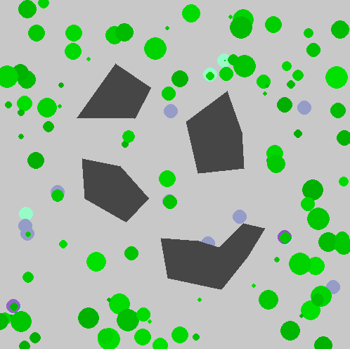
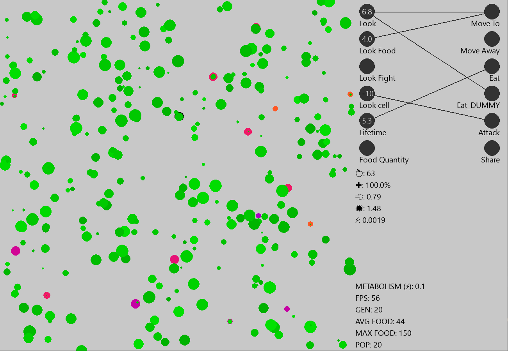
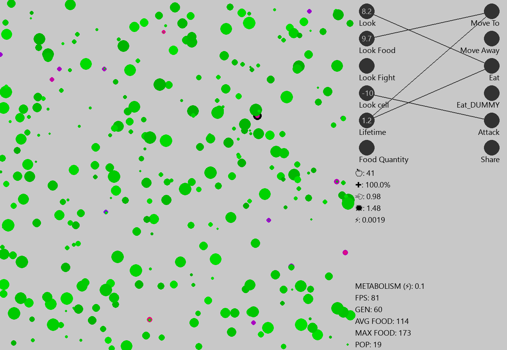
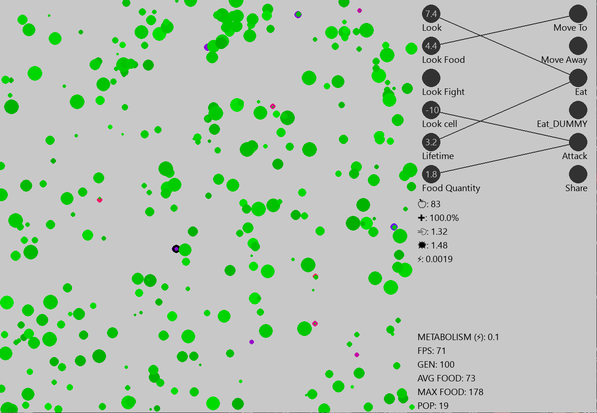

# PyEcoSim

### 
Simulating evolving cells in an adaptive environment.

## Features
The system implements a number of cells (30) wich have both a genome and a series of neurons, connected in a "neural network" fashion.
In the old version the DNA was represented by a binary string, but to allow faster and more readable results this has been switched to a series of hexadecimal values stored in an array.

To allow mutations, after every *cycle* each decimal digit has a probability of becoming another random one.
Each cycle lasts 30 seconds; after the end of this cycle, if more than 15 cells survive only the 15 with the most food stored get to reproduce.

If more than 15 cells died, 15 or more cells are randomly generated.
When a cell gives birth to a child, the son receives the donor genome with random mutations.

When the average food among all cells is over 100, the "metabolism cost" (how much energy is consumed per second) increases by 0.05.     
If the average food is below -200, the "metabolism" decreases by 0.05.

## UI
Despite currently only having an FPS display, a cell counter and a generation overview display, at the end of the project there will be an accurate display of each cell's brain when a determined entity is selected.
A custom environment and cell creator will be implemented along with a "history" overview, which will display each generation with its inhabitants.

*The following images show the same simulation through different stages of evolution. The different cells colour highlights the different generations they were born in.*

 ### Initial cells adapting to the environment.
 
 ### The cells start to stabilize with about 100 food on average.
 
 ### The cells are mostly stable, with either a carnivore or a herbivore diet.
 

# STATUS
* Currently working on the new cell's brain
