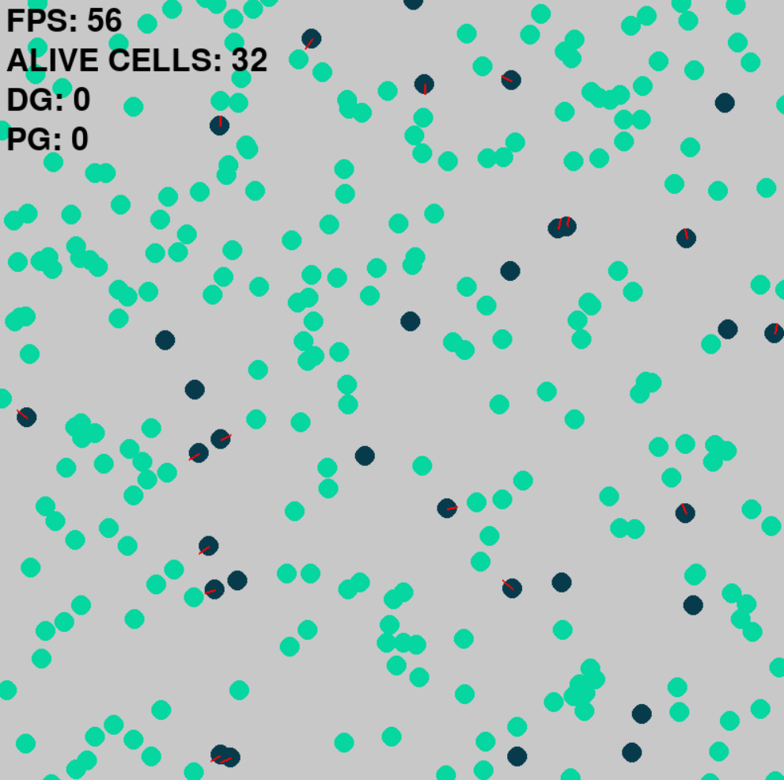
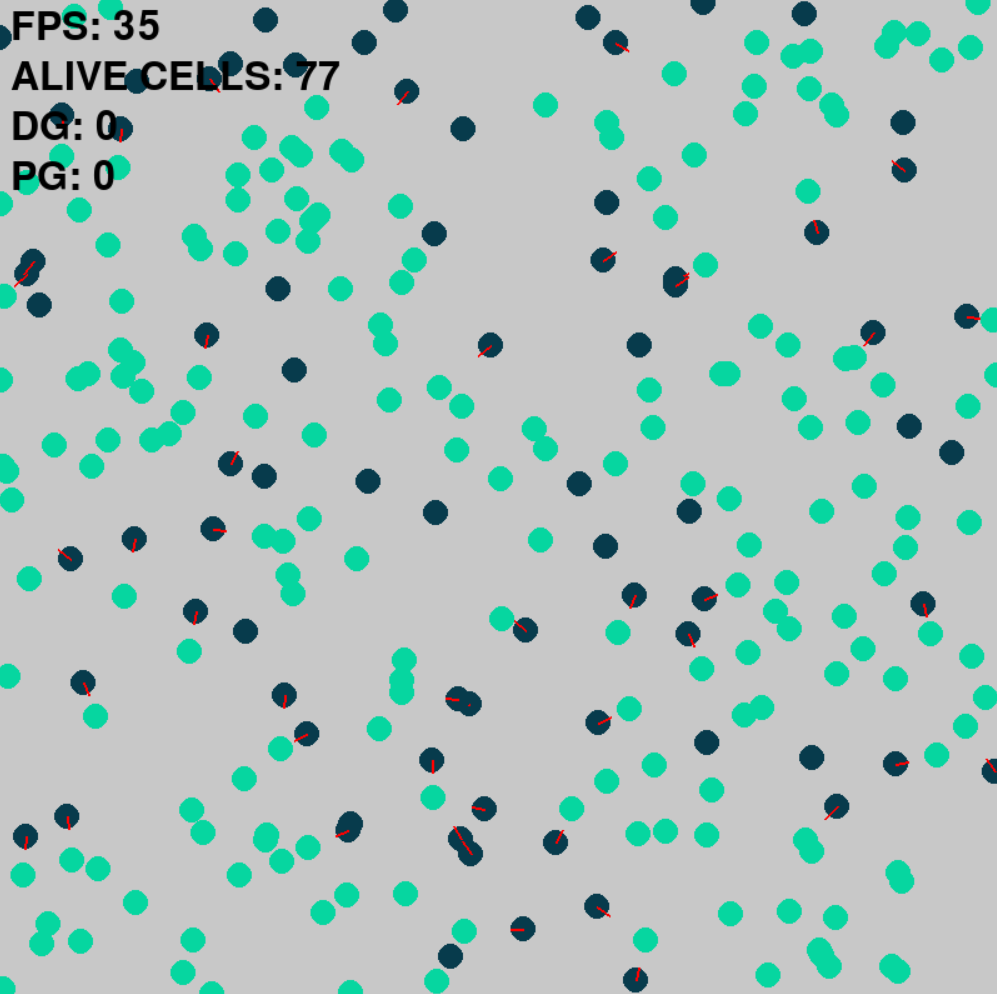

# PyEcoSim
An ecosystem simulator written in Python with genes and a low-level brain.
This simulator is currently under a complete overhaul process; all images shown were generated from the old version found in the `OLDVER` branch.

## Features
The system implements a series of cells (30) wich have both a genome and a series of neurons, connected in a "neural network" fashion.
In the old version the DNA was represented by a binary string, but to allow faster and more readable results this has been switched to a series of hexadecimal values stored in an array.

To allow mutations, after every *cycle* each decimal digit has a probability of becoming another random one.
Each cycle lasts 30 seconds (if cells manage to survive); after the end of this cycle, if more than 15 cells survive only the 15 with the most food stored get to reproduce.
If more than 15 cells died, 15 or more cells are randomly generated.
When a cell gives birth to a child, the son receives the donor genome with random mutations.

## UI
Despite currently only having an FPS display, a cell counter and a generation overview display, at the end of the project there will be an accurate display of each cell's brain when a determined entity is selected.
A custom environment and cell creator will be implemented along with a "history" overview, which will display each generation with its inhabitants.

*Please note all images down below were generated by the outdated simulator. Graphical, performance and UI features will be updated in the new version.*

   

# STATUS
* Currently working on the new cell's brain
